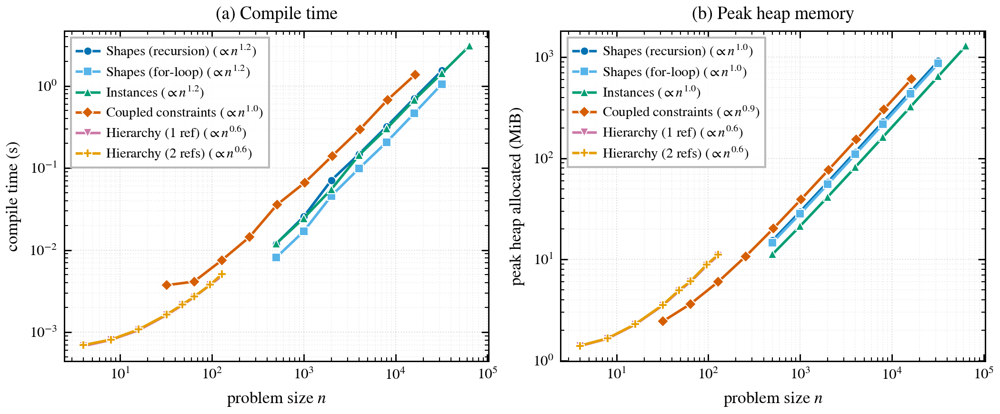

# Argon scaling benchmarks

These benchmarks stress the Argon compiler along the axes raised in review —
**number of shapes**, **number of (coupled) constraints**, **number of cell
instances**, and **depth of hierarchy** — and record how compile time and peak
memory scale with each. They exist to answer questions of the form:

> *How does the framework scale to layouts with substantially more hierarchy,
> more constraints, and a larger number of editable objects?*

The Argon sources that are swept live in [`../examples/`](../examples):

| Example                          | Cell(s)                 | Axis stressed |
| -------------------------------- | ----------------------- | ------------- |
| `examples/stress_shapes`         | `shapes(n)`             | `n` independent rectangles in one cell (generated by recursion) |
| `examples/stress_shapes`         | `shapes_loop(n)`        | the same geometry generated with a `for` loop over `std::range` (also stresses the functional list representation) |
| `examples/stress_constraints`    | `constraints(n)`        | a ring of `n+1` rectangles whose edges are mutually coupled, forcing the general (dense) linear solver |
| `examples/stress_instances`      | `instances(n)`          | `n` instances of a single cached leaf cell |
| `examples/stress_hierarchy`      | `h0 .. h8`              | a chain of cells `h{k}` each instantiating `h{k-1}`; compiling `h{k}` exercises `k` levels of hierarchy |

The benchmark *drivers* are the `bench_*` tests in
[`../core/compiler/src/lib.rs`](../core/compiler/src/lib.rs). For the
hierarchy axis the driver generates `h0..h{depth}` workspaces on the fly (a
single `.ar` file cannot express a runtime-variable depth because Argon cells
cannot be recursive or forward-referenced).

## Running

The easiest way to run the benchmarks and regenerate every artifact is the
wrapper script [`run_benchmarks.sh`](run_benchmarks.sh):

```bash
bench/run_benchmarks.sh                   # all axes
bench/run_benchmarks.sh bench_instances   # one axis (any libtest name filter)
```

It rebuilds the compiler in **release**, runs all `bench_*` tests **serially**,
writes `bench/results/<axis>.csv`, redraws `bench/argon_scaling.{png,pdf}`, and
prints a fitted-scaling summary table. With the default sweeps it takes about a
minute and peaks near ~1.3 GiB on the current build. Per-axis sweep sizes pass
straight through as environment variables (see
[Configuring the sweeps](#configuring-the-sweeps)):

```bash
ARGON_BENCH_CONSTRAINTS=64,128,256 bench/run_benchmarks.sh bench_constraints
```

> **Note for AI agents.** Prefer this script over invoking `cargo test`
> directly — it encodes the flags that are easy to get wrong (release,
> `--test-threads=1`, the `bench_` name filter) and the figure regeneration.
> Two things to know:
>
> 1. The script regenerates `bench/results/*.csv` and the figure
>    **deterministically, but it does NOT edit this file.** The
>    [Results](#results) table and interpretation prose are **hand-written**, so
>    after a run you must diff the printed summary (and the CSVs) against them
>    and update anything that changed. Peak-**memory** values are deterministic:
>    a difference there is a real discrepancy to fix, not noise. Wall-clock
>    **times** drift a few percent run-to-run, so small changes there are
>    expected.
> 2. Do **not** set `RUSTFLAGS` for these runs — building `-p compiler` does not
>    need the GUI's linker flags. Any you already export are harmless but
>    unnecessary.

### What the script runs

`run_benchmarks.sh` is a thin wrapper over two steps you can also run by hand
(e.g. to debug a single axis):

```bash
cargo test -p compiler --release -- --ignored --test-threads=1 --nocapture bench_
python3 bench/plot_scaling.py     # writes bench/argon_scaling.{png,pdf}
```

The `bench_*` tests are marked `#[ignore]` (the larger sizes take well over 6 s
in a debug build), so `--ignored` is required. They MUST run in **release** and
**serially**: peak-memory tracking uses a process-global allocator, so
concurrent tests would corrupt each other's measurements. The trailing `bench_`
filter keeps the run from also executing the other (`#[ignore]`'d) tests. Each
test writes `bench/results/<axis>.csv` with columns
`size,time_s,peak_bytes,n_objects`. `plot_scaling.py` needs only the standard
library to print the summary table; `matplotlib` is required to draw the figure.
The figure is drawn for the ACM `acmart` `sigconf` camera-ready format: it is
sized to the full two-column text width (~7 in, i.e. a `figure*`), uses a
colorblind-safe palette with distinct markers (legible in grayscale), and
embeds its fonts as Type 42 — never Type 3, which ACM's TAPS pipeline rejects —
so the PDF drops into the paper at `width=\textwidth` with no font-shrinking
rescale. The fast `stress_*_smoke` tests (which just check that each example
still compiles) run in the normal `cargo test` suite and are **not** ignored.

### Configuring the sweeps

Every axis reads its list of sizes from an environment variable, falling back
to a default. This keeps the benchmarks general-purpose: the same test can be
re-run at a different scale — for example after a compiler optimization changes
how an axis scales — without editing any source. Pass a comma-separated list:

| Env var | Axis | Default |
| ------- | ---- | ------- |
| `ARGON_BENCH_SHAPES`        | shapes (recursion)   | `500,1000,2000,4000,8000,16000,32000` |
| `ARGON_BENCH_SHAPES_LOOP`   | shapes (`for` loop)  | `500,1000,2000,4000,8000,16000,32000` |
| `ARGON_BENCH_INSTANCES`     | instances            | `500,…,64000` |
| `ARGON_BENCH_CONSTRAINTS`   | coupled constraints  | `32,64,128,256,512,1024,2048,4096,8192,16384` |
| `ARGON_BENCH_HIER_SINGLE`   | hierarchy (1 ref)    | `4,8,16,32,48,64,96,128` |
| `ARGON_BENCH_HIER_DOUBLE`   | hierarchy (2 refs)   | `4,8,16,32,48,64,96,128` |

```bash
# e.g. sweep the for-loop variant out to the same sizes as bench_shapes
ARGON_BENCH_SHAPES_LOOP=500,1000,2000,4000,8000,16000,32000 \
  cargo test -p compiler --release -- --ignored --test-threads=1 --nocapture bench_shapes_loop
```

The defaults are sized so the full suite runs in about a minute within ~1.3 GiB
on the current build; they are not claims about how any axis "should" scale.

## Methodology

- **Time**: minimum wall-clock time over a few repetitions (`min` is robust to
  noise on a shared machine). Parsing/static analysis is done once per size and
  excluded from the hierarchy timings; everything else is end-to-end `compile()`.
- **Memory**: a `#[global_allocator]` compiled only into the test binary
  (`bench_alloc::Tracking` in `lib.rs`) tracks live and peak heap bytes. We
  report the peak heap *growth* during a single `compile()`.
- **Build**: release profile. Numbers below were collected on a Linux machine;
  absolute values are machine-dependent but the *scaling* is not.

## Results

The numbers below are a **snapshot** from one release build on the development
machine; they are produced by the commands above and meant to be regenerated
(absolute values are machine- and build-dependent). `n` is the per-axis size
parameter; "peak" is peak heap allocated during compilation.

| Axis | largest `n` | time @ largest | peak mem @ largest | empirical scaling |
| ---- | ----------- | -------------- | ------------------ | ----------------- |
| Shapes (recursion)           | 32 000 rects   | 1.54 s  | 0.89 GiB | **~linear** (time `∝ n^1.2`, mem `∝ n^1.0`) |
| Instances                    | 64 000 insts   | 3.08 s  | 1.26 GiB | **~linear** (time `∝ n^1.2`, mem `∝ n^1.0`) |
| Hierarchy, 1 child ref       | depth 128      | 0.005 s | 11 MiB   | **linear** in depth |
| Coupled constraints          | 16 384 rects   | 1.37 s  | 0.59 GiB | **~linear** (time `∝ n^1.0`, mem `∝ n^0.90`) |
| Shapes (`for`-loop)          | 32 000 rects   | 1.06 s  | 0.85 GiB | **~linear** (time `∝ n^1.2`, mem `∝ n^1.0`) |
| Hierarchy, 2 child refs      | depth 128      | 0.005 s | 11 MiB   | **linear** in depth (was exponential before the shared-type fix) |

### Interpretation

- **Geometry and instances scale linearly.** Compiling a single flat cell with
  tens of thousands of fully-constrained rectangles, or with tens of thousands
  of instances of a cached cell, is linear in both time and memory. Each shape
  contributes 4 solver variables and each instance 2, and because their
  constraints pin one variable at a time the solver resolves them by
  back-substitution without ever forming a matrix. This is the common case for
  real parametric cells and it scales comfortably to "thousands of rectangles".

- **Coupled constraints now scale linearly too.** When constraints form one
  large connected component that 1-variable back-substitution cannot crack
  (here, a ring of mutually-coupled edges), the solver first runs a sparse
  *elimination pre-pass*: it generalizes back-substitution to 2-variable
  "definitional" constraints, expressing one variable in terms of another and
  substituting it out of the few constraints that mention it. Because a
  2-variable constraint replaces one variable with one variable, this never
  increases any constraint's size — the ring's leaf edges drop out and its
  chain telescopes to a single closure, so the system is solved in `O(n)` and
  the dense SVD never runs. The general dense solver is retained only as a
  fallback for an *irreducible* coupled core (a block with no ≤2-variable
  pivot). This axis used to be **super-cubic** — `~22 s` at `n=1024`, steepening
  toward the `O(n^3)` of dense factorization — and is now `~n^1.0` in time
  (`1.37 s` at `n=16384`, 16× larger, in less memory than the old `n=1024`
  dense matrix used). The "general linear constraint solving (slow)" caveat in
  the top-level README now bites only for genuinely dense coupled blocks, not
  for the common sparse-but-coupled case.

- **Hierarchy depth scales linearly.** A cell's static type (`CellTy`) records
  the structural type of every field, including instantiated sub-cells. That
  type is now **shared** (`Arc`-interned via `CellFnTy::cell`) instead of being
  copied into each reference, so the type representation is a DAG rather than a
  tree: whether a cell references its child **once** (`let i = inst(child());`)
  or **twice** (the `let c = child(); let i = inst(c);` idiom from the tutorial),
  `h{k}` holds shared pointers to the single type of `h{k-1}`, and both variants
  cost the same — linear in depth (≈11 MiB / 5 ms at depth 128, the two series
  within ~5% of each other). Before this fix the type was deep-copied per
  reference, so the single-ref chain was quadratic (`~depth^1.4`) and the
  double-ref chain **doubled with every level** (`×1.9` measured), exhausting
  memory beyond ~depth 20 (depth 18 alone took ~3.6 GiB / 11.5 s). The remaining
  hierarchy limit is unrelated to the type representation: very deep chains hit a
  native-recursion stack limit in the compiler at a few hundred levels.

- **Recursion and iteration now scale identically.** `shapes` and `shapes_loop`
  emit identical geometry; the only difference is that `shapes_loop` builds and
  iterates a `std::range` list. That list path used to be quadratic — emitting
  just 2 000 rectangles through a `for` loop cost ≈4 GiB (against 32 000 by
  recursion in under 1 GiB), because `range` was built by repeated `cons` onto a
  `Vec` (an O(n) clone-and-prepend per element). Backing sequences with a
  persistent vector and lowering `range` to a native builtin made `cons`
  O(log n) and `range` O(n); the two series now coincide, both linear in time
  and memory out to 32 000 rectangles (`shapes_loop`: 1.06 s / 0.85 GiB;
  `shapes`: 1.54 s / 0.89 GiB). The idiomatic `for i in std::range(n)` loop is
  no longer a scaling hazard. The gap between the two series is now a small
  constant — `shapes_loop` is even marginally faster, as the native `range`
  avoids the per-element recursion overhead of `emit_shapes`.

The takeaways for the paper: editable-object count, instance count, hierarchy
depth, and now coupled-constraint count all scale linearly. The dense general
solver is no longer a practical limit for sparse-but-coupled systems — the
elimination pre-pass reduces them first — and remains the fallback only for
irreducible dense constraint blocks with no ≤2-variable pivot, which lines up
with the "faster linear constraint solving" future-work item in the project
README. The bullets above describe the build at the time of measurement; because
every axis is re-runnable (and size-configurable), the same harness can be used
to confirm improvements from compiler optimizations.


